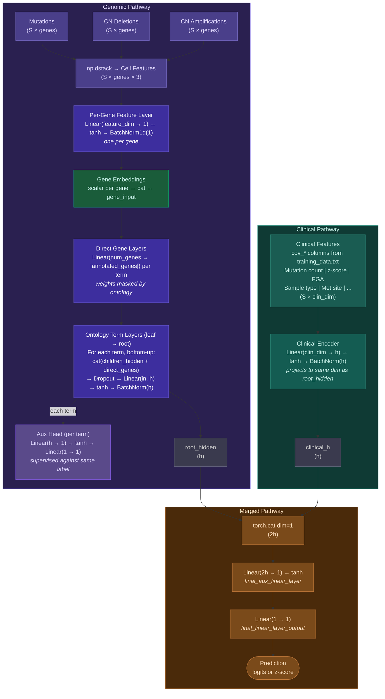

# CellMap-VNN New Architecture

Genotype + Clinical Covariates

## Forward pass summary

| Step | Layer | Input shape | Output shape |
|------|-------|-------------|--------------|
| 1 | `np.dstack` | 3 matrices (S × genes) | S × genes × feature_dim |
| 2 | Per-gene `Linear → tanh → BatchNorm` | S × feature_dim (per gene) | S × 1 (per gene) |
| 3 | `torch.cat` gene embeddings | S × 1 × num_genes | S × num_genes |
| 4 | Direct gene layer (per term) | S × num_genes | S × \|annotated_genes\| |
| 5 | Ontology term layers (leaf → root) | S × (children_h + direct_genes) | S × h |
| 5a | Aux head (per term) | S × h | S × 1 (loss only) |
| 6 | Clinical encoder | S × clin_dim | S × h |
| 7 | `torch.cat([root_hidden, clinical_h])` | S × h, S × h | S × 2h |
| 8 | `Linear(2h, 1) → tanh` | S × 2h | S × 1 |
| 9 | `Linear(1, 1)` | S × 1 | S × 1 |

Where **h** = `num_hiddens_genotype` (default 4), **S** = batch size.
